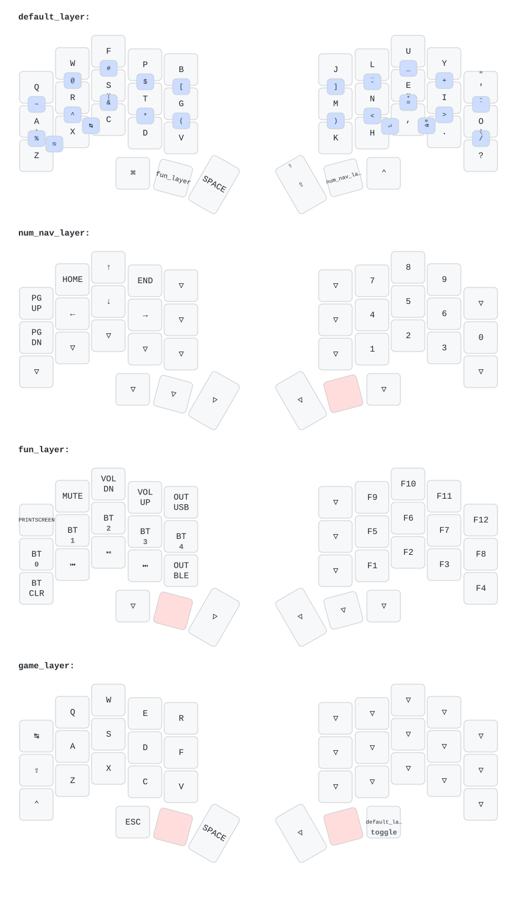

# Temper ZMK Config

This is my personal ZMK config for the [temper](https://github.com/raeedcho/temper).

Some notes about this config:
- Four layers are defined: a Colemak-DHm default layer, a num/nav layer, a function layer, and a game layer
- Default (Colemak) layer uses [urob's timerless homerow mods](https://github.com/urob/zmk-config#timeless-homerow-mods)
- Default layers uses combos for all symbols (also heavily inspired by [urob's using combos instead of a symbol layer](https://github.com/urob/zmk-config#using-combos-instead-of-a-symbol-layer)
- The num/nav layer puts navigation on the left hand and a numpad on the right hand
- The function layer has media, Bluetooth, and function keys, and is used to switch between the default and game layers
- The game layer provides a simpler gaming layout focused on the left hand usage
- Keymap was drawn using [caksoylar/keymap-drawer](https://github.com/caksoylar/keymap-drawer) and a bunch of AI generated scripts to achieve "merging several layers into one keyboard drawing" (once more inspired by urob's keymap image)

